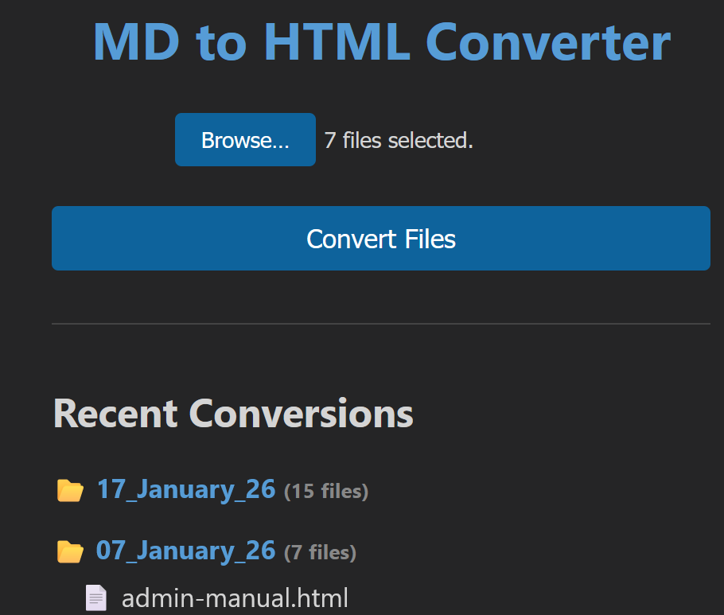

# MDtoHTML - Markdown to HTML Converter


A powerful,  Markdown (*.md) to HTML converter with dark theme support, Mermaid diagrams, syntax highlighting, and conversion history tracking. Perfect for creating beautiful documentation, technical guides, and knowledge bases.

REALLY OUTPUTS ALL THE DIFFERENT TABLES, MERMAIDS, FLOWCHARTS, GRAPHS, CODE BLOCKS, ETC. 
EXACTLY AS THEY APPEAR IN VS CODE MARKDOWN PREVIEW AND ON GITHUB.

## ✨ Features

- **🎨 VS Code Dark Theme**: Beautiful dark mode styling that mirrors VS Code's markdown preview
- **📊 Mermaid Diagram Support**: Automatic rendering of flowcharts, sequence diagrams, state diagrams, and more
- **💡 Syntax Highlighting**: Code blocks with syntax highlighting powered by highlight.js
- **🔗 Auto-TOC Links**: Automatically generates heading IDs for functional Table of Contents navigation
- **📦 Batch Conversion**: Web interface for converting multiple files at once
- **📅 Organized Output**: Date-stamped directories for easy file management
- **📜 Conversion History**: Browse and access your last 10 conversion batches
- **⚡ Fast & Lightweight**: No heavy dependencies, runs locally

## 🚀 Quick Start

### Installation

```bash
git clone https://github.com/LuCIDDre@mS/mdtohtml.git
cd mdtohtml
npm install
```

### Usage

#### Web Interface (Recommended)

```bash
npm run dev
```

Open `http://localhost:3000` in your browser, select your Markdown files, and click **Convert Files**. Your HTML files will be saved in `html_converted/<Date_Directory>/`.

#### Command Line

```bash
node md2html.js input.md [output.html]
```

If no output file is specified, it defaults to the same directory as the input file.

## 📋 Requirements

- Node.js >= 14.0.0
- npm or yarn

## 🎯 Use Cases

- **Technical Documentation**: Convert GitHub README files to standalone HTML
- **Knowledge Bases**: Build internal documentation with consistent styling
- **Blog Posts**: Transform Markdown drafts into HTML for publishing
- **Presentations**: Generate HTML slides from Markdown
- **Code Reviews**: Share formatted code documentation

## 🛠️ Technology Stack

- **Marked**: GitHub-flavored Markdown parser
- **marked-gfm-heading-id**: Automatic heading ID generation
- **marked-highlight**: Syntax highlighting integration
- **highlight.js**: Code syntax highlighting
- **Mermaid**: Diagram and flowchart rendering
- **Express**: Web server
- **Multer**: File upload handling

## 📖 Documentation

For detailed information, see:
- [Project Manual](docs/PROJECT_MANUAL.md) - Comprehensive guide with architecture details and troubleshooting

## 🔧 Configuration

Output files are automatically organized in `html_converted/` with date-stamped directories (e.g., `17_January_26/`). The conversion history displays the latest 10 batches on the web interface.

## 🤝 Contributing

Contributions are welcome! However, please note the license restrictions (non-commercial use only). 

### Guidelines

- Follow existing code style
- Test your changes thoroughly
- Update documentation as needed
- Credit AI assistance when applicable

## 📜 License

This project is licensed under **Creative Commons Attribution-NonCommercial 4.0 International (CC BY-NC 4.0)**.

**This means you can:**
- ✅ Use this software for personal and non-commercial purposes
- ✅ Modify and adapt the code
- ✅ Share and distribute (with attribution)

**Under these conditions:**
- 📝 **Attribution Required**: You must give appropriate credit to **LuCIDDre@mS**
- 🚫 **Non-Commercial**: Commercial use is not permitted without explicit permission
- 🔄 **Share-Alike**: Derivative works must carry the same license

See [LICENSE](LICENSE) for full details.

## 🙏 Credits

- **Author**: LuCIDDre@mS
- **AI Assistant**: Developed with assistance from Anthropic's Claude (Antigravity IDE)
- **Inspired By**: VS Code's Markdown Preview styling
- **Dependencies**: See [package.json](package.json) for full list

## 🔍 Keywords

markdown converter, markdown to html, markdown parser, github markdown, documentation generator, mermaid diagrams, syntax highlighting, vs code theme, dark mode, static site generator, markdown preview, technical documentation, knowledge base, documentation tool, markdown processor

## 📞 Support

Found a bug or have a feature request? Please open an issue on GitHub.

## ⭐ Star History

If you find this project useful, please consider giving it a star on GitHub!

---

**Made with ❤️ by LuCIDDre@mS with AI assistance**
